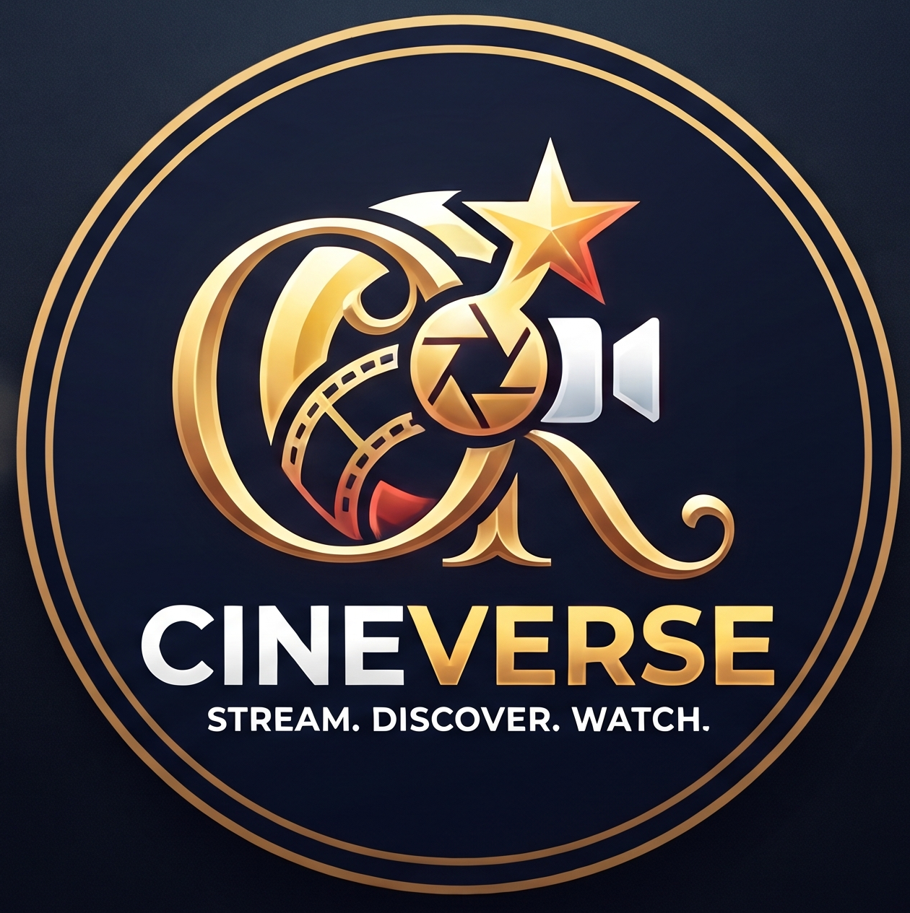
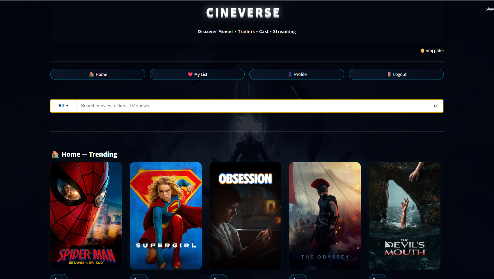
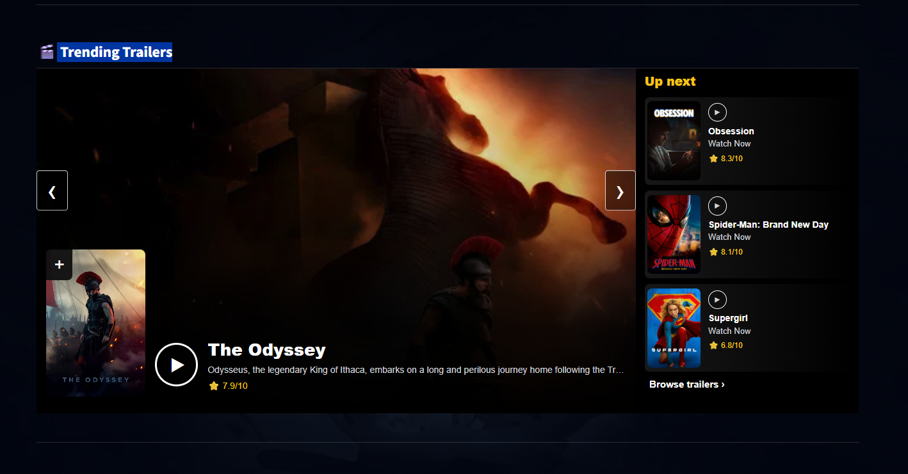
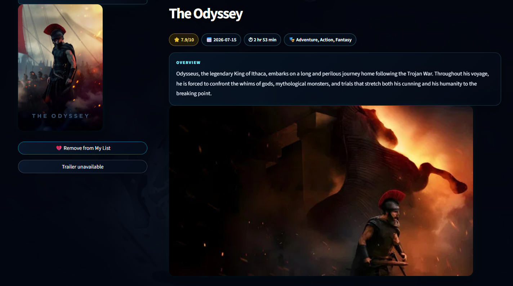
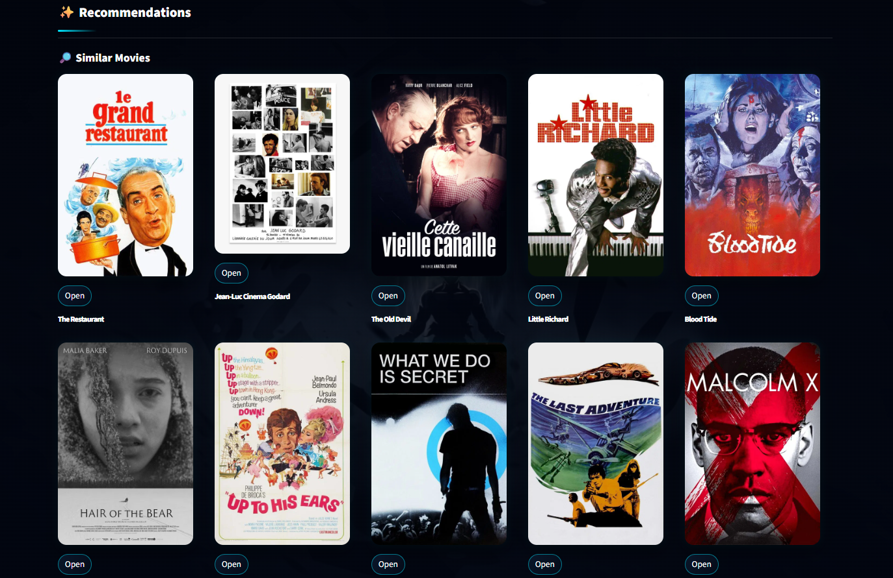
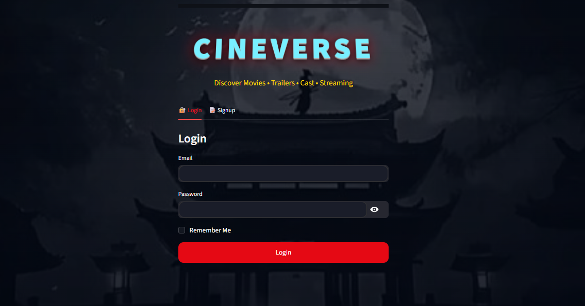
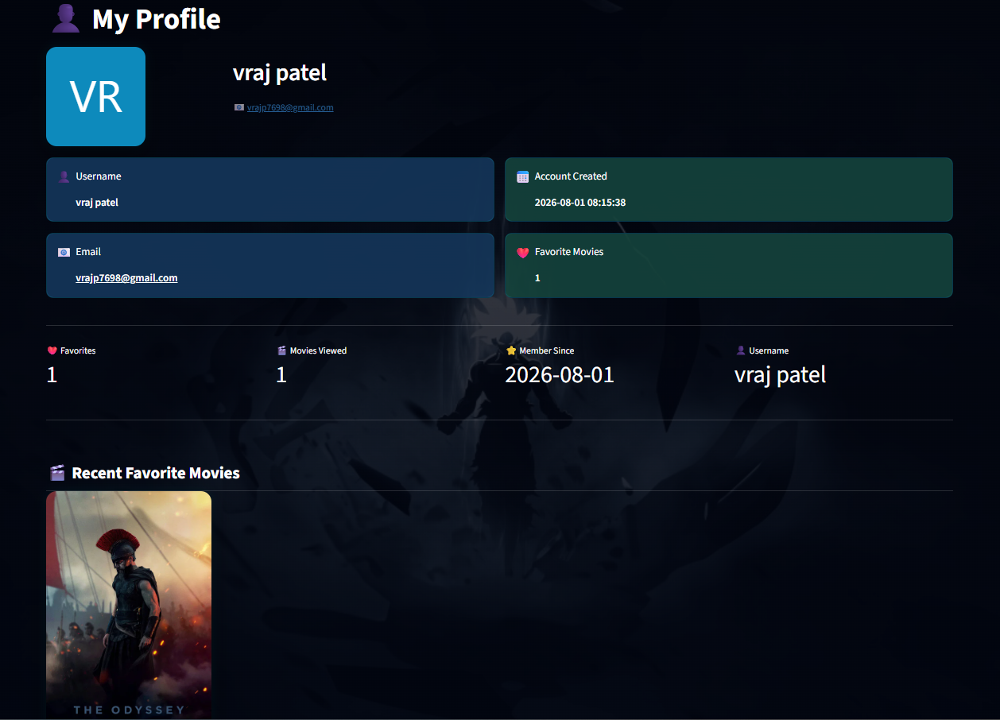

# 🎬 CineVerse - Movie Recommendation System

<p align="center">
  
</p>

<p align="center">


</p>

<h3 align="center">
Discover Movies • Watch Trailers • Explore Cast • Get Smart Recommendations
</h3>

<p align="center">
A Netflix-style Movie Discovery Platform built using <b>Machine Learning</b>, <b>FastAPI</b>, <b>Streamlit</b>, and the <b>TMDB API</b>.
</p>

---

# 🌐 Live Demo

🚀 **Website:**  https://cineverse-movies.streamlit.app/

---

# 🎥 Project Demo

▶ **Watch Project Demonstration**

> *(Add your demo video here)*

```
image/Demo_Video.mp4
```

---

# 📌 About The Project

**CineVerse** is a Movie Recommendation and Exploration platform that helps users discover movies, explore cast details, watch trailers, and receive intelligent movie recommendations using Machine Learning.

The project combines:

- 🤖 Machine Learning Recommendation System
- 🎬 TMDB Movie Database API
- ⚡ FastAPI Backend
- 🎨 Streamlit Interactive Frontend
- 👤 User Authentication System

The goal of this project is to provide a modern movie platform similar to **Netflix** and **IMDb**, allowing users to discover entertainment content effortlessly.

---

# ✨ Features

## 🎬 Movie Discovery

- Trending Movies
- Popular Movies
- Top Rated Movies
- Upcoming Movies
- Genre-wise Browsing

---

## 🤖 Movie Recommendation System

Content-Based Recommendation System using:

- TF-IDF Vectorization
- Cosine Similarity
- Movie Metadata Analysis

Users receive personalized movie recommendations based on the selected movie.

---

## 🎭 Movie Details

Explore complete movie information:

- Movie Poster
- Ratings
- Overview
- Release Date
- Genres
- Runtime
- Cast Information
- Actor Details

---

## 🎞 Trailer Integration

Watch official movie trailers directly inside the application using TMDB video data.

---

## 📺 Streaming Platform Availability

Shows where the movie is available to stream:

- Netflix
- Amazon Prime Video
- JioHotstar
- SonyLIV
- ZEE5
- Apple TV+

---

## 👤 User Authentication

Features include:

- User Registration
- Secure Login
- User Profile
- Session Management

---

# 🖼 Screenshots

## 🏠 Home Page

<p align="center">


</p>

---

## 🎬 Movie Details

<p align="center">


</p>

---

## 👤 Authentication

<p align="center">


</p>

---

# 🏗 System Architecture

<p align="center">

</p>

---

# 🛠 Tech Stack

## 🎨 Frontend

- Streamlit
- HTML
- CSS
- JavaScript

---

## ⚡ Backend

- FastAPI
- Python

---

## 🤖 Machine Learning

- Scikit-Learn
- Pandas
- NumPy
- TF-IDF Vectorizer
- Cosine Similarity

---

## 🗄 Database

- SQL Database
- User Authentication Storage

---

## 🌐 APIs

- TMDB API

---

## ☁ Deployment

- Streamlit Cloud
- GitHub

---

# 📂 Project Structure

```
Movie-Recommendation-System/
│
├── app.py
├── main.py
├── requirements.txt
├── README.md
│
├── movie_api/
│   ├── tmdb.py
│   └── routes.py
│
├── models/
│   ├── similarity.pkl
│   └── movies_list.pkl
│
├── assets/
│   ├── images/
│   └── videos/
│
└── .env
```

---

# ⚙️ Installation & Setup

## 1️⃣ Clone Repository

```bash
git clone https://github.com/Vraj7698/Movie-Recommendation-System.git
```

---

## 2️⃣ Navigate to Project Folder

```bash
cd Movie-Recommendation-System
```

---

## 3️⃣ Create Virtual Environment

```bash
python -m venv .venv
```

Activate Environment (Windows)

```bash
.venv\Scripts\activate
```

---

## 4️⃣ Install Dependencies

```bash
pip install -r requirements.txt
```

---

## 5️⃣ Create Environment Variables

Create a `.env` file inside the project root.

```env
TMDB_API_KEY=your_tmdb_api_key
DATABASE_URL=your_database_url
```

---

## 6️⃣ Run Streamlit

```bash
streamlit run app.py
```

---

## 7️⃣ Run FastAPI

```bash
uvicorn main:app --reload
```

---

# 🔌 API Endpoints

| Method | Endpoint | Description |
|----------|-----------------------------|----------------|
| GET | `/movie/{movie_id}` | Movie Details |
| GET | `/movie/{movie_id}/cast` | Movie Cast |
| GET | `/movie/{movie_id}/images` | Movie Images |
| GET | `/movie/{movie_id}/watch-providers` | Streaming Providers |

---

# 🧠 Machine Learning Workflow

<p align="center">

</p>

---

# 🚀 Future Improvements

- Next.js Frontend
- PostgreSQL Integration
- JWT Authentication
- Personalized Recommendations
- AI Movie Assistant Chatbot
- Advanced Search
- Mobile Responsive Design
- SEO Optimization
- Custom Domain
- Dark/Light Theme

---

# 👨‍💻 Developer

## Vraj Patel

**Computer Engineering Student**

### Skills

- Python
- Machine Learning
- FastAPI
- Streamlit
- SQL
- Data Science

---

# ⭐ Support

If you like this project, please consider giving it a **⭐ Star** on GitHub.

Your support motivates further development.

---

# 📜 License

This project is developed for educational and portfolio purposes.